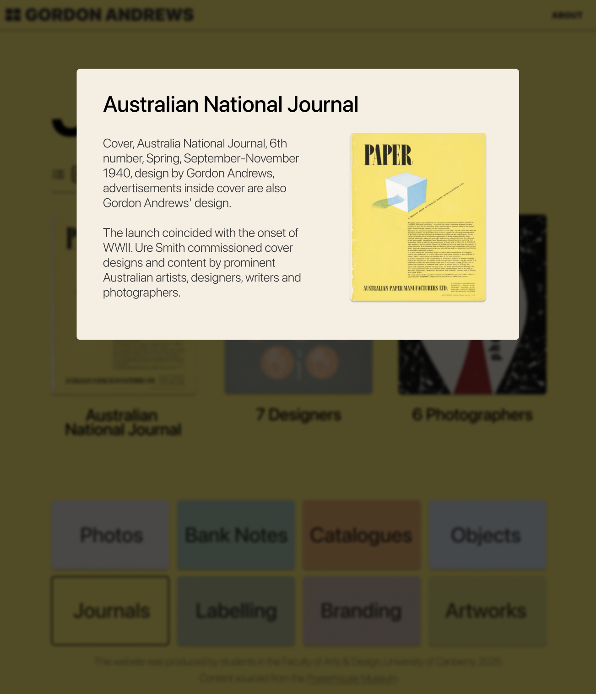

# Rationale

## Reflection
### Home page
The intention for the home page was to create a responsive, unique, and interesting navigation to access all aspects of Gordon Andrews' work. The primary issue of creating the homepage was the mosaic masonry layout of the categories as shown:

Initially the intention was to use `grid-template-columns: masonry;` to achieve the layout. However, due to the rigid plan of the category boxes and centre square location, combined with the nature of the masonry value only being applicable to the grid in one direction (e.g. Pinterest's masonry column layout with fixed item width), this was not possible. Instead, fractional values were logically devised in order to achieve the required layout. This resulted in 5 columns and 3 rows by means of: `grid-template-columns: 2fr 2fr 1fr 2fr 2fr;` and `grid-template-rows: 3fr auto 3fr;`. This allowed each category to utilise `grid-column/row: span a/b`, and be effectively reponsive by changing the span and columns for the mobile view. The central image was constrained into its square aspect ratio and scaling size through `aspect-ratio: 1; width: 100%; height: auto;`, allowing for the image to scale whilst the grid around it adapts.

The breakpoint for the site was based upon where the grid categories became too small of width to both look aesthetically pleasing and contain appropriately-sized text, "letting the content guide the breakpoints" (GeeksForGeeks, 2024). This turned out to be at 820px screen width.

Globally, `font-size: clamp(x,y,z);` was used for the text, as it provides excellent responsiveness by "clamping a middle value within a range of values between a defined minimum bound and a maximum bound" (Mozilla, 2025).

The colours of each category were each adopted from a separate distinct work of Andrews' in the category. These colour choices meant it both incorporated his work into the site, and provided an authentic era-appropriate colour palette. The incorporation of these colours throughout the site (home page, category pages, footer navigation) took advantage of the css feature of variables. For example: `--artworks-color: rgb(214,210,108);`. The significant advantage of using variables in the site, particularly for colours, was the ability to change the colour a posteriori and have it reflect throughout the entire site, thereby "simplifying CSS code, improving scalability, and improving code reusability" (ApeScript, 2023).

Throughout the site, linked elements have feedback in the form of scaling down on hover to indicate interactivity and "set accurate user expectations and help them understand how to interact with the interface" (Nielsen Norman Group, 2025). Additionally the footer navigation on hover will change style from a full background colour to just an outline to align with the indicator of current page.

Due to the overall nature of the home page not being scrollable, the height of the page had to be 100vh. However, this unit does not account for certain UI elements changing shape, especially in mobile browsers whilst scrolling (e.g. the bottom search field in iOS Safari.), causing the content to be hidden behind these UI elements on a site which is meant to be entirely visible without scrolling. This is remedied by using 100dvh or 100% of the dynamic viewport height, in which "the viewport is sized with dynamic consideration of any UA interfaces that are dynamically expanded and retracted" (Frehner, 2021).

As an improvement to the home page, and provided extended time for the task, the central image would change on a page refresh. This could be done through a javascript array of images and cycle through, or randomly select, an image from it.

### Category Pages

The category pages utilise the aforementioned variable colours as the background, allowing for a unique and distinctive feel for each page. A grid of thumbnails and titles for each work is displayed, dynamically adjusting the columns with the page by: `grid-template-columns: repeat(auto-fit, minmax(16rem, 1fr));` (essentially fitting as many columns with 16rem minimum as possible, and spreading them out using the 1fr (if there's remaining space)). This dynamic technique allows for inherent responsiveness from desktop to mobile. When clicking on each work, a lightbox appears with additional description information and a larger preview of the image. 

The lightbox was created using the `data-xyz="abc"` attributes of each item: `data-title`, `data-desc`, and `data-img` as one can "use data attributes to put information in HTML that JavaScript may need access to do certain things" (Coyier, 2020). Additionally javascript was used in order to add click event listeners to each item, and on click changing the lightbox from `display: none;` to `display: block;`, adding the 'no-scroll' class to the body so it doesn't scroll with the lightbox, and setting each lightbox element (e.g. title) to the respective dataset. A user can exit the lightbox through the javascript functionalities of the click event listener on the 'x' icon, the keydown event for the escape key, and clicking outside the lightbox (onto the lightbox container) - the last requiring the aid of GenAI, as when adding the click event listener for the lightbox container, it will recognise a click on the lightbox itself as the event too. The solution provided was to add `lightbox.addEventListener('click'), (event) => {event.stopPropagation();})`. This stopPropagation stops the click from reaching the lightbox container, by limiting the propagation to the lightbox itself. 
The lightbox changes when being resized, particularly down to mobile view in which it takes form of a 'popup card' style:

In this mobile view of the lightbox, ideally an implementation of swiping down on the lightbox would dismiss it. This may be implemented in javascript for future versions, however due to time constraints this was not added.

In casual user testing of the site, users wished for a way to navigate between each item in a category whilst in the lightbox, and future versions of the site will strive to implement this lacking functionality.

As a final improvement, future iterations would shrink the file sizes of the images as on slower networks the pages don't load instantly.

### About Pages

The about page is responsive to the screen size, with shrinking text and images, as well as after reaching the breakpoint the content gets stacked by changing the flex direction from row to column:

## Prototypes

### Figma Link
https://www.figma.com/design/uouacyv78kj2H9dod6EV35/Gordon-Andrews--Alt-?node-id=0-1&t=ph110iaRDqpE1B2U-1

### Desktop Prototypes

The Homepage final design aligned in structure with the prototype. Adjustments were made to some colours, the position of certain categories (e.g. bank notes to a horizontal container instead of vertical), and images (in order to align better with the content they represent). 

The category page prototype originally had two options for viewing the items, a grid and a list. However, concerning the scope and time limit of the assignment, only the grid view was adopted. Future versions of the website may incorporate this secondary view. 

The lightbox did not see much change aside from the incorporation of an 'x' to close to complement the other forms of closing the lightbox.

### Mobile Prototypes

The mobile prototypes had the same changes implemented unto them as were altered in the desktop version, including the minor homepage edits and singular category page layout.

## References

### Resource List
https://dev.to/frehner/css-vh-dvh-lvh-svh-and-vw-units-27k4 - Used to figure out how to do 100vh whilst respecting changing broswer UI elements. 

https://css-tricks.com/a-complete-guide-to-data-attributes/ - Used to work with the data attributes and incorporating them into the javascript.

https://chat.deepseek.com - Used to advise on how to disable clicks on the lightbox from acting as a click on the lightbox container, thereby dismissing it

### Reference List
ApeScript. (2023, January 30). CSS Variables: How to Use Them and Why They Matter - ApeScript. ApeScript. https://www.apescript.com/frontend/css-variables-how-to-and-why-they-matter/#The_Benefits_of_Using_CSS_Variables

Coyier, C. (2020, February 18). HTML Data Attributes Guide | CSS-Tricks. CSS-Tricks. https://css-tricks.com/a-complete-guide-to-data-attributes/#attributes-javascript

Frehner, A. (2021, November). CSS *vh (dvh, lvh, svh) and *vw units. DEV Community. https://dev.to/frehner/css-vh-dvh-lvh-svh-and-vw-units-27k4GeeksforGeeks. (2024, May 10). What is a Breakpoint in Responsive Web Design? 

GeeksforGeeks. https://www.geeksforgeeks.org/what-is-a-breakpoint-in-responsive-web-design/#when-should-a-standard-responsive-breakpoint-be-added

Mozilla. (2025). clamp() - CSS: Cascading Style Sheets | MDN. Developer.mozilla.org. https://developer.mozilla.org/en-US/docs/Web/CSS/clamp

Nielsen Norman Group. (2025, April 25). Button States: Communicate Interaction. Nielsen Norman Group. https://www.nngroup.com/articles/button-states-communicate-interaction/

## Live Link to Project
https://tane-simons.github.io/gordon-andrews/index.html